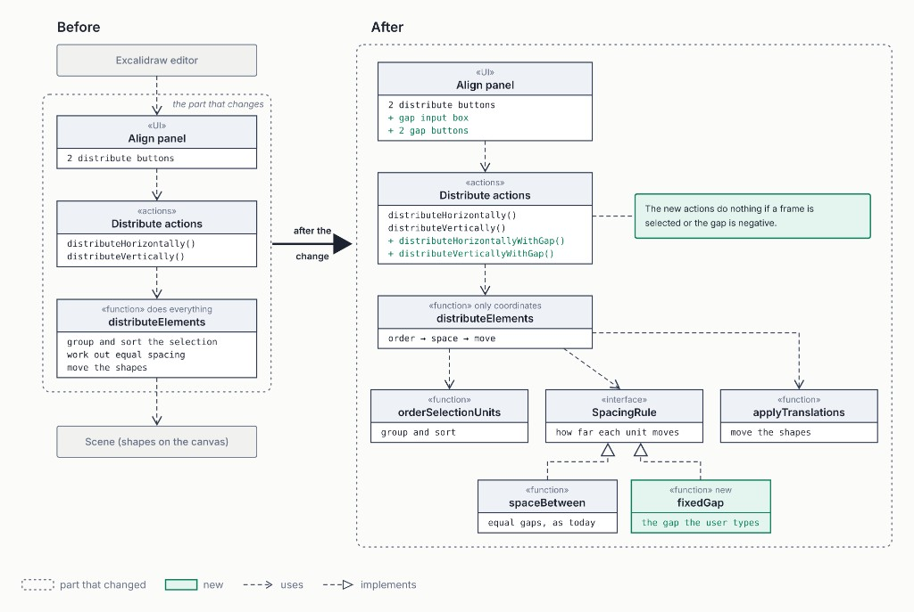

# Excalidraw - CMU 17-695

Course copy of [excalidraw/excalidraw](https://github.com/excalidraw/excalidraw) (MIT). See [`COURSE.md`](./COURSE.md).

## Run

Node >= 18 and Yarn 1.

```bash
yarn install
yarn start                 # http://localhost:3000
yarn test:typecheck
yarn test:code
yarn test:app --watch=false
```

Just Request 05:

```bash
yarn vitest run packages/element/tests/distribute.test.tsx \
  packages/element/tests/spacing.test.ts \
  packages/element/tests/distributeWithGap.test.tsx
```

---

## Samarth Shukla

- **Andrew ID:** sshukla3@andrew.cmu.edu
- **GitHub:** [@samarthshukla6](https://github.com/samarthshukla6)

### Request 05 - Arrange objects with a specified gap

The old Distribute buttons only even out leftover space inside whatever width the selection already has. You cannot type a number. This request lets you enter a gap (say 24) and space selected objects by that amount, even when they are different sizes.

### The change



`distributeElements` used to group, sort, compute gaps, and move shapes, and the move loop was written twice. It is now four parts:

1. **`orderSelectionUnits`** groups the selection into units (a group of shapes counts as one) and sorts by box centre. Same sort as before.
2. **`spaceBetween` / `fixedGap`** take bounding boxes and return how far to move each one. No scene, so they test on plain numbers.
   - `spaceBetween` is the old rule: equal leftover gaps inside the current extent, plus the old centre fallback when boxes do not fit.
   - `fixedGap` is new: first unit stays put, each next one starts at the previous end + the typed gap.
3. **`applyTranslations`** is the one move loop. Bound labels and arrows still update here.
4. **`distributeElements`** looks the rule up in a `spacingRules` table and runs the three.

`Distribution` is `{ space: "between" }` or `{ space: "fixedGap", gap }`. `gap` only exists on the new rule. The table is typed: a third rule with no entry is a compile error. The coordinator and the old actions stay as they are.

UI: two new actions (Distribute horizontally / vertically with gap, no shortcut) and a number input (min 0) in Align. Value is `appState.currentItemDistributeGap`, default **24**. The two old actions were not edited.

`perform` itself refuses the move if the selection has a **frame** (Excalidraw's container around other shapes), fewer than 3 units, or a negative / non-numeric gap. It returns the elements unchanged. This is not only a disabled button.

### Results of the checks

These are the proposal's step checks. All of them are in the repo. The Request 05 command under Run reruns the automated ones.

| Asked | Observed |
| --- | --- |
| Characterization tests first, using today's output (fixture + centre fallback) | Done first. A at x=0 w100, B (group of two) at x=120 w50, C at x=198 w80: old command gives **0, 124, 154, 198**. Centre fallback: **0, 100, 100**. |
| Extract group/sort and the move loop. Existing `distribute.test.tsx` unedited. Order test on overlapping shapes. | File unedited, **4/4**. Overlap order by centre: **B, A, C**. Group B is one unit: `[A], [B1, B2], [C]`. |
| Old math in `spaceBetween` still gives **0, 150, 300** | **0, 150, 300**, same as the old tests. |
| `fixedGap`: unequal widths, gap 0 (boxes touch), overlapping starts, first-by-centre does not move | Unequal: **0, 124, 198**. Gap 0: **0, 100, 150**. Overlap: first stays at **30**, then **140, 350**. |
| New actions. Reject negative gap and frames inside `perform`. Both commands with gap 24 match on the fixture. B is a group. | Both give **0, 124, 154, 198**. Negative gap, NaN, fewer than 3 units, or a frame: nothing moves. |
| Gap input, `appState` field, label. Snapshot diff is only the new key. | Only `currentItemDistributeGap: 24` (133 lines, all that key). |
| Integration: rotated rectangle, bound label, group, frame | Rotated unit: gap 24 on the rotated box. Label moves with its container. Group is one unit. Frame: no-op. |

`yarn test:typecheck`: 0 errors. `yarn test:code`: clean. `spacing.test.ts` **12/12**. `distributeWithGap.test.tsx` **20/20**. `align.test.tsx` **50/50**.

Manual (type a gap, click the button): three rects at 100/w200, 420/w90, 560/w160. Old button: **100, 385, 560** (gaps 85/85). New button at gap 60: **100, 360, 510** (first shape unmoved).

### What changed from the RFC

- **Offsets, not final positions.** The RFC had rules return where each box should sit. The code returns how far to move it, which is what the old function already computed. So `spaceBetween` matches today, including 0, 150, 300.
- **A third rule needs one table entry.** The RFC said no edit outside the new function and the union. The rule still has to be reachable, so it is one function, one union member, and one entry in `spacingRules`. The coordinator is not edited. Adding a dummy member produced one type error, on the table.
- **The two commands do not always agree.** Same positions only when the first object in order is also the leftmost. Otherwise the gaps match but the whole run shifts: `fixedGap` anchors on the first object, `spaceBetween` on the left edge of the selection. There is a test for each case.
- **Two files the RFC did not list:** `packages/common/src/constants.ts` (`DEFAULT_DISTRIBUTE_GAP = 24`) and `packages/excalidraw/components/Actions.scss` (gap row layout).

### What remains

- **Frames are not distributed.** A frame is Excalidraw's container around other shapes. The old buttons already refuse a selection that contains one (`TODO enable distributing frames when implemented properly`). The new buttons do the same, including inside `perform`. Frame support was out of scope.
- No keyboard shortcut. One axis per click.
- The gap is between **bounding boxes**. For a rotated shape that is the rotated box, not the drawn edge.
- Labels are in `en.json` only.

---
